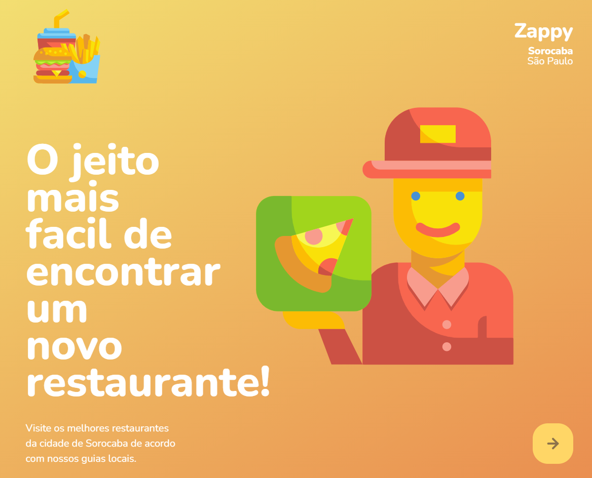
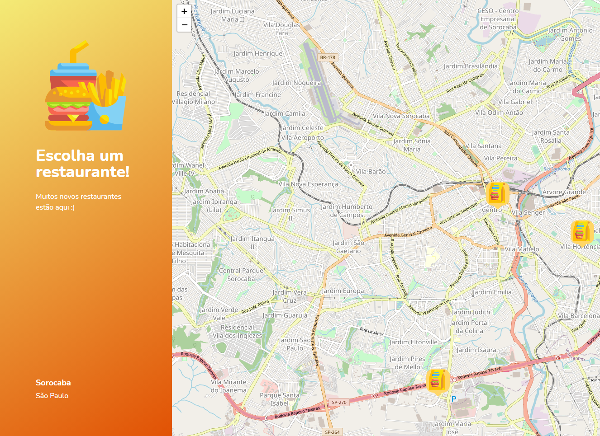
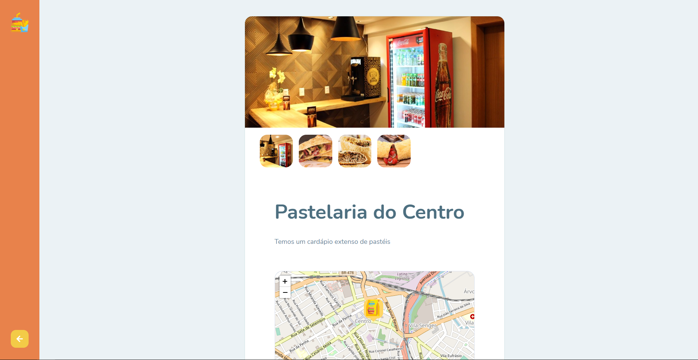
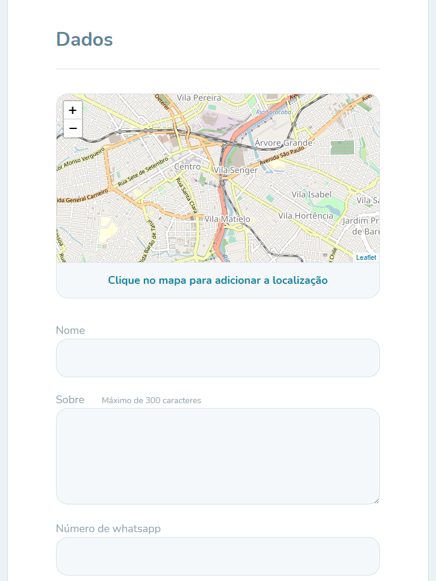

# Zappy-Restaurant Search NLW

<h1>Home</h1>

<h1>Restaurantes</h1>

<h1>Exemplo de Restaurante</h1>

<h1>Criação de um novo Restaurante</h1>

<h3>Tecnologias usadas:</h3>

<ul>
<li>HTML5</li>
<li>CSS3</li>
<li>JavaScript</li>
<li>Node.js</li>
<li>Express</li>
<li>SQLite</li>
<li>Handlebars</li>
</ul>

<a href="https://www.figma.com/file/mDEbnoojksG4w8sOxmudh3/Happy-Web?node-id=0%3A1"><h4>Link do layout do projeto.</h4></a>

<a href="https://www.rocketseat.com.br">
Rocketseat.
</a>
